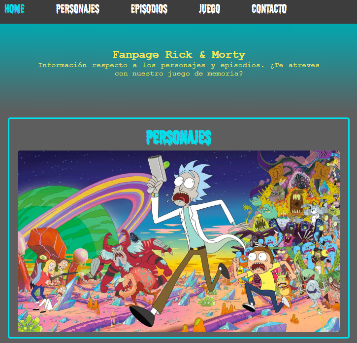

# Rick & Morty

Fanpage donde encontrar información respecto a los personajes y episodios donde además podrás escribirnos. ¿Te atreves con nuestro juego de memoria?

## Personas que han desarrollado el proyecto

* Ainhoa Hernandez
    Github: https://github.com/AinhoaSalo
* Julen Mendioroz
    Github: https://github.com/JulenMendioroz
* Luis Vázquez
    Github: https://github.com/luisfaro13
* Noelia Prieto
    Github: https://github.com/NoeliaPH
* Raquel Cardoso
    Github: https://github.com/raqcar16

## Prerequisitos

**Node.js**
Tener instalado Node.js
Para comprobar si Node.js esta instalado:
entrar en la terminal e introducir el comando:
node -v

**NPM**
En la terminal ponemos:

*npm init*

Con esto arrancamos npm, despues ponemos:

*npm install*

Así se instala todos los paquetes que he usado en el proyecto.

